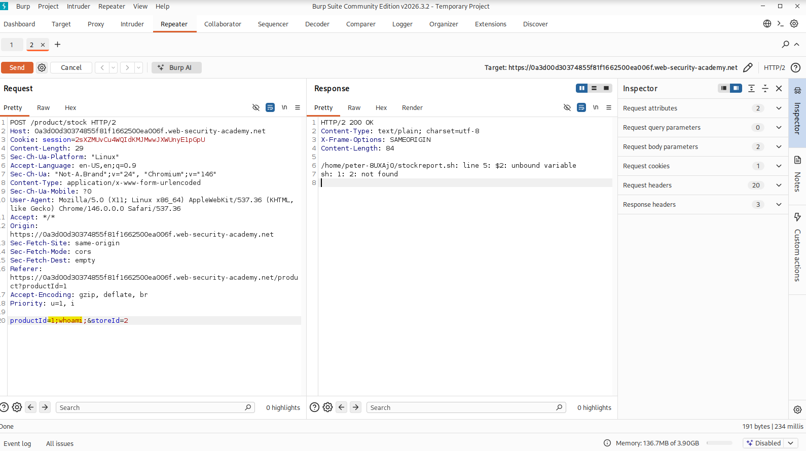
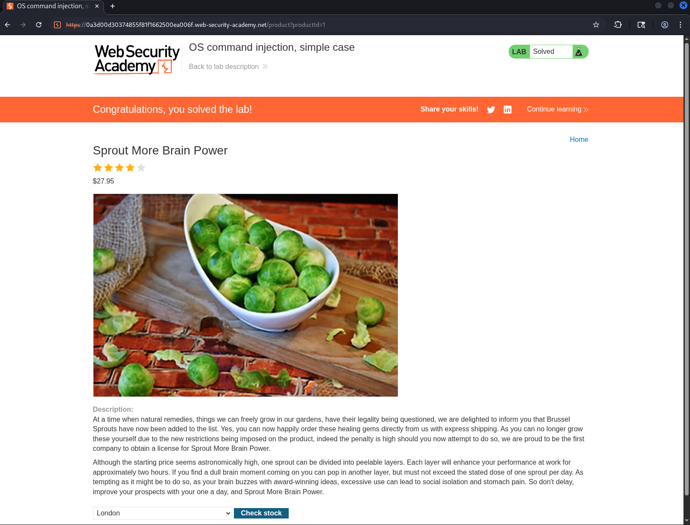

# OS Command Injection – Simple Case (PortSwigger)

**Category:** OS Command Injection  
**Difficulty:** Apprentice  
**Lab:** OS command injection, simple case

---

## 🧠 Objective
Exploit an OS command injection vulnerability in the stock checker functionality by injecting system commands into a POST parameter.

---

## 📝 Vulnerability Summary
The application sends a POST request to the `/product/stock` endpoint:

```
productId=1&storeId=2
```

The backend passes these parameters directly into a shell command without sanitization.  
Because the input is concatenated into a system command, an attacker can append additional shell commands using separators such as `;`.

This allows arbitrary command execution on the server.

---

## 🎯 Exploitation
I intercepted the stock checker request in Burp Suite and sent it to Repeater.  
Then I injected a command into the `productId` parameter to execute `whoami` on the server.

### 🔹 Modified POST body:
```
productId=1;whoami;&storeId=2
```

### 🔹 Why this works
The semicolon (`;`) tells the shell to **end the original command** and execute a new one.  

### 🔹 Server response (from Burp Repeater)
The response included output from the executed command, confirming successful command injection.

---

## 📸 Screenshots

 

---

## ✅ Result
The injected command executed successfully, confirming the OS command injection vulnerability and solving the lab.
