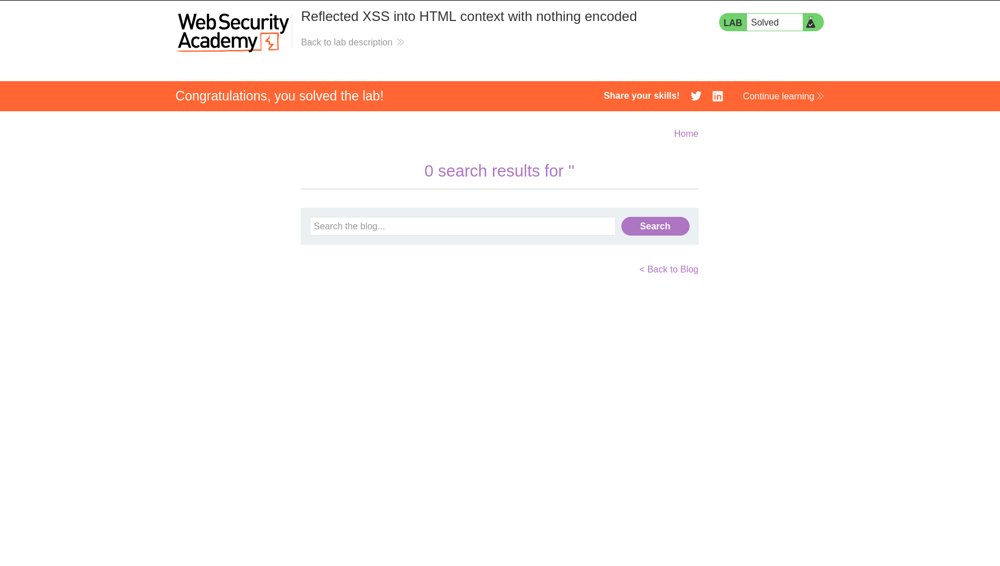

# Reflected XSS – HTML Context (PortSwigger)

**Category:** Cross-Site Scripting (XSS)  
**Difficulty:** Apprentice  
**Lab:** Reflected XSS into HTML context with nothing encoded

---

## 🧠 Objective
Exploit a reflected Cross-Site Scripting (XSS) vulnerability where user input is inserted directly into the HTML response without any encoding, allowing arbitrary JavaScript execution.

---

## 📝 Vulnerability Summary
The application reflects the value of the search parameter directly into the HTML body.  
There is no:

- HTML encoding  
- JavaScript encoding  
- Input validation  
- Output sanitization  

Because of this, injecting a `<script>` tag results in immediate execution when the page loads.

---

## 🎯 Exploitation
I entered a JavaScript payload into the search bar.  
The application reflected it back into the page without sanitizing or encoding the characters `<` and `>`, allowing the browser to interpret the payload as executable JavaScript.

### 🔹 Payload used:
```html
<script>alert(1)</script>
```

This payload executes because the browser treats it as a legitimate `<script>` element.

### 🔹 What happened
The injected script was rendered inside the HTML response and executed automatically, triggering a JavaScript alert box.  
This confirms a **reflected XSS vulnerability** in an HTML context.

---

## 📸 Screenshots




---

## ✅ Result
The injected script executed successfully, confirming the reflected XSS vulnerability and solving the lab.
